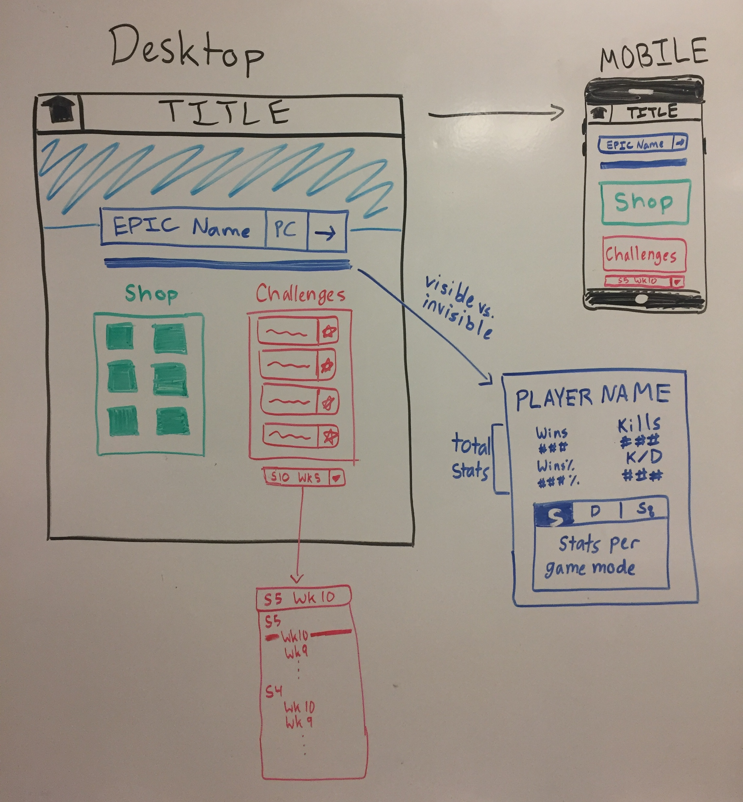
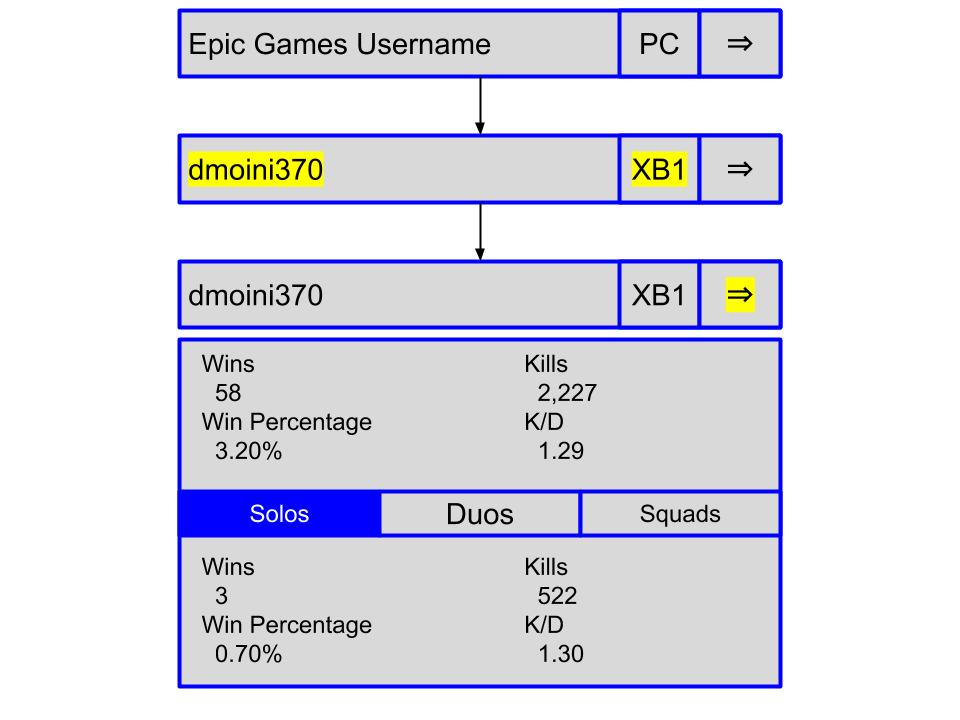
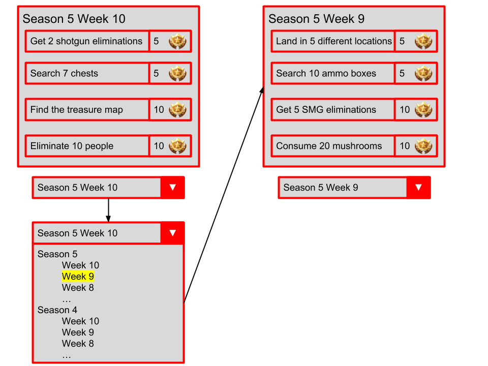

## Application Description
This application is a Fortnite web application that is able to track and display the stats of any player with an Epic Games account, display the current items in the Fortnite item shop, and display the weekly challenges from any season and week of Fortnite. A search functionality will allow users to search for any Fortnite player’s stats such as wins, win percentage, kills, and kill-death ratio (K/D) for both the total game and specific game modes, and display them below the search bar. The Fortnite shop will be displayed below the search bar, and will show the current items in the Fortnite shop in an organized, two-column grid. The challenges will be displayed to the right of the shop section, and will display the current weekly challenges by default. If the user wishes to look at previous weekly challenges, the user can update the displayed weekly challenges via a dropdown menu below the challenge section. This web application is restricted to a single page, so navigation is intended to be simple for all users. The main functionality of this web application is the search bar, which is directly in the center of the screen. If the username of username/platform combination is invalid, the application will alert the user of the error.

### Web Service(s) Used
The first web service will get the player’s stats. Upon the user entering in a player’s Epic Games username, the API will get the player’s stats via https://fortnite-public-api.theapinetwork.com/prod09/users/public/br_stats. This will return stats such as kills, wins, matches played, K/D, and more, and it returns both the total stats and stats specific to certain game modes. The second web service will get the current items in the Fortnite store via https://fortnite-public-api.theapinetwork.com/prod09/store/get. This will return each available item, its image, its name, its rarity, its type (skin, glider, pickaxe, or emote), and its cost. The third web service will return the challenges from any season of Fortnite via https://fortnite-public-api.theapinetwork.com/prod09/challenges/get. Depending on what season the user selects via the dropdown menu below where the challenges are displayed, this call returns the specific challenges from the selected season. All web services are fully documented [here](https://fortniteapi.com/).

## Top-Level Design/Layout

The screen will consist of three section: the search bar/stats, the shop items, and the weekly challenges. The search will allow users to search for any player’s Fortnite stats by entering the player’s Epic Games username and selecting the appropriate console for that player. After specifying the information, clicking on the search arrow will expand the area below to display stats for wins, win percentage, kills, and (K/D) for both the total game and for specific game modes. The shop section will display the current items in the Fortnite shop. No interaction is required from the user for this section. The last section displays the current weekly challenges. If the user wants to look at previous weekly challenges, the user can do so by clicking on the dropdown menu below the challenge section and choose the desired season and week.

## Usage Scenarios
> A usage scenario is a mini-story that highlights how a user would accomplish a certain task in your front end. Provide at least two. Make sure to provide the following information per scenario: (a) the task that the user will perform, (b) the relevant user interface elements for performing this task, and (c) a brief narrative on how the user would perform this task with those user interface elements. Mock up, animate, or annotate your scenarios liberally.

### Searching for a specific player’s Fortnite Battle Royale stats
The user must click on the search bar in the middle of the screen and types in the desired player’s Epic Game username. The user must also click the dropdown menu next to the username input field to choose the specified console (PC, Xbox One, PS4) of the player. After a username has been entered and a platform chosen, the user clicks on the search arrow at the far right of the search bar to request the stats of the searched player. If the username or username/platform combination is not found, an error will be brought up addressing the error. Upon retrieval of the stats, below the search bar a section will appear which shows the stats of the player including total wins, win percentage, kills, and K/D. Additionally, if the user wants to see these stats per game mode (Solo, Duos, Squad), a selectable tab bar below the total stats will allow the user to see the player’s stats per game mode.

### View a set of challenges from a past week and season
The user must locate the challenge section of the web application, which for desktop is in the bottom right and on mobile is at the bottom. Once located, the user must locate the dropdown menu below the challenge section. Interacting with the dropdown menu will show all the previous seasons and weeks chronologically. Upon the user choosing the desired week, the challenge section will update with the challenges from the chosen week.

## Design Rationale
One of the guidelines used in this web application is to avoid multiple search features.1 This website is limited to a single search bar, with the only parameter being an Epic Games username (and technically a dropdown to choose platform of username. An additional guideline used is “help users recognize, diagnose, and recover from errors”.2 The main error with this web application will be users searching for unavailable usernames or username and platform combinations. Upon recognizing this error, and alert will prompt with the user’s error and instructions on how to properly search for the desire player’s stats. A third guideline that is used is making sure to “match between system and the real world”.3 Since this web application is intended for Fortnite players, the aesthetic will look similar to the aesthetic of Fortnite to feel like an extension of the game.

## Usability Metric Forecast
My design would excel in subjective satisfaction because it is intentionally meant for Fortnite players. Using my website should feel like an extension of Fortnite itself, so Fortnite players should feel comfortable with the aesthetics of it. People who do not follow Fortnite will not have the same feedback, but this design is intentionally designed for specifically Fortnite players. Additionally, learnability and efficiency should be strong. In terms of learnability, the website has a simple, one-page layout with minimal user interaction. The user interaction is limited to a search bar and a dropdown menu, which are easy to learn. For efficiency, once a user grasps the concept of using a search bar and dropdown menu, the user has essentially mastered the usage of the website.

A weak metric for my design would be errors. While fewer errors are preferred, errors are not a priority in my web application because the information being retrieved is not nearly as valuable as something such as payments or calculations in a budget management software. One error that will be common is users searching for unavailable usernames or username and platform combinations, and this website has no way of controlling what the user inputs.

## References
1: https://www.nngroup.com/articles/employee-directory-search/.

2, 3: https://www.interaction-design.org/literature/article/user-interface-design-guidelines-10-rules-of-thumb.
